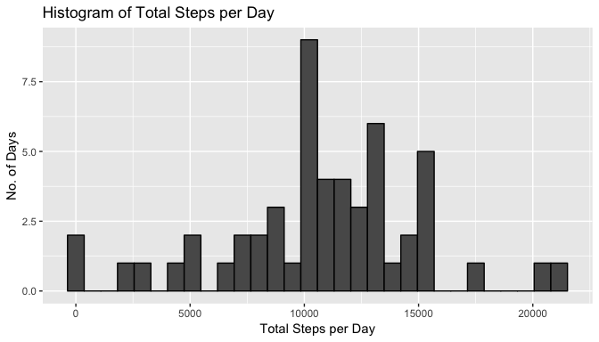
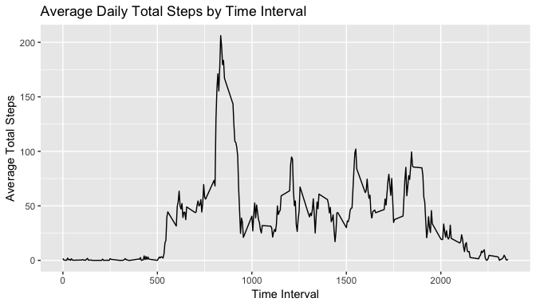
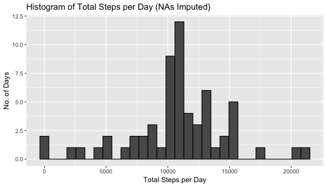
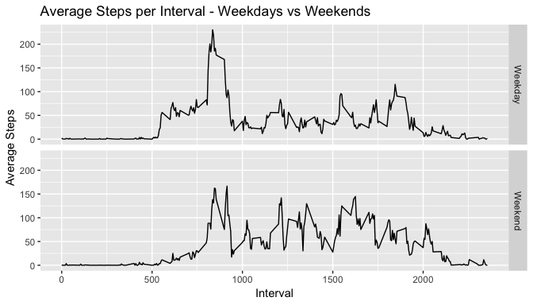

Load and Initialise all packages
--------------------------------

The first step is to load and initialise the necessary R packages which
will be used for analysis

    library(dplyr)
    library(ggplot2)
    library(lubridate)

Loading and preprocessing the data
----------------------------------

Once packages have been loaded, the required file is downloaded

    fileurl <- "https://d396qusza40orc.cloudfront.net/repdata%2Fdata%2Factivity.zip"
    download.file(fileurl, destfile = "activity.zip")
    if(!file.exists("activity.csv")){
        unzip("activity.zip")
    }

The CSV is then read into a tibble using dplyr and the date data is set
to the right format

    df <- tbl_df(read.csv("activity.csv",na.strings = "NA"))
    df$date <- as.Date(df$date, format = "%Y-%m-%d")

What is mean total number of steps taken per day?
-------------------------------------------------

First we calculate the total number of steps taken daily

    total_steps_daily <- summarise(group_by(df, date), total_steps = sum(steps))

The histogram for the total number of steps taken each day is shown
below

    ggplot(total_steps_daily, aes(x=total_steps)) + 
        geom_histogram(colour = "black") + 
        labs(title ="Histogram of Total Steps per Day", x="Total Steps per Day", y="No. of Days")

Ignoring NAs, the mean and median can be calculated as follows

    mean_steps_daily <- mean(total_steps_daily$total_steps, na.rm=T)
    median_steps_daily <- median(total_steps_daily$total_steps, na.rm=T)

The mean total daily steps is **10766.19** and the median total daily
steps is **10765**

What is the average daily activity pattern?
-------------------------------------------

Code to calculate average steps for each 5-min interval across all days

    avg_daily_pattern <- summarise(group_by(df,interval), mean_steps = mean(steps, na.rm=T))

Line plot of average daily pattern

    ggplot(avg_daily_pattern, aes(interval, mean_steps)) + 
            geom_line() +
            labs(title = "Average Daily Total Steps by Time Interval", x = "Time Interval", y = "Average Total Steps")

Code to calculate the maximum interval is as follows:

    max_interval <- avg_daily_pattern[which.max(avg_daily_pattern$mean_steps),1]

The time interval that contains the maximum number of steps is **835**
am. This corresponds to the 104th 5-min interval

Imputing missing values
-----------------------

The total numer of missing values in the dataset is

    sum(is.na(df$steps))

    ## [1] 2304

To impute missing values, I have used the mean for the 5-min interval to
replace the missing values. This can be done in three steps:

#### Step 1: Filter df for NAs

    na_steps <- filter(df, is.na(steps))

#### Step 2: Replace NAs with mean for that 5-min interval from the avg\_daily\_pattern dataframe

    df_impute <- left_join(na_steps, avg_daily_pattern, by = "interval") %>% 
            select(-steps) %>% rename("steps" = mean_steps)

#### Step 3: Combine the original dataset df and imputed dataset to create df2 - a dataset without missing values

    df2 <- rbind(df_impute, df) %>% filter(!is.na(steps))

Code to calculate total number of steps taken each day:

    df2_total_steps <- summarise(group_by(df2,date), total_steps = sum(steps))

Histogram of total number of steps taken each day

    ggplot(df2_total_steps, aes(x=total_steps)) + geom_histogram(colour = "black") + 
            labs(title ="Histogram of Total Steps per Day (NAs Imputed)", x="Total Steps per Day", y="No. of Days")

The mean and median steps taken each day can be calculated as follows:

    mean_steps_daily_df2 <- mean(df2_total_steps$total_steps, na.rm=T)
    median_steps_daily_df2 <- median(df2_total_steps$total_steps, na.rm=T)

The mean is **10766.19** and the median is **10766.19**

The mean does not differ from the estimates from the first part of the
assignment. This is because we excluded NA values from the calculation
of the mean earlier and the missing data was replaced with the mean for
the interval, the total number of steps for each of these 8 days are the
same as the mean (10766.19) which was calculated earlier.

The median however, differs by a slight amount as each of the missing
days have the same total steps value of 10766.19 which is slightly
higher than the original median total steps of 10765

The impact of imputing missing values may skew the overall data
dependning on the methodology used to replace the missing values. In
this case, since the mean of the 5-min intervals was used, the resulting
impact to the overall mean and median was insignificant.

Are there differences in activity patterns between weekdays and weekends?
-------------------------------------------------------------------------

The code to create a new factor variable to indicate whether a date is a
weekday or weekend is as follows.

#### Step 1: Mutate dataframe to indicate day of week based on date

    df2 <- mutate(df2, Day_of_week= wday(df2$date, label = F, week_start = 1))

#### Step 2: Assign "Weekday" of "Weekend" factor based on day of week

    df2_weekday <- filter(df2, Day_of_week <6) %>% mutate(Type = "Weekday")
    df2_weekend <- filter(df2, Day_of_week >5) %>% mutate(Type = "Weekend")

#### Step 3: Combine dataframes and assign to df2

    df2 <- rbind(df2_weekday,df2_weekend)

Calculate the mean number of steps based on this new dataframe

    df2_mean_steps <- summarise(group_by(df2,interval,Type), mean_steps = mean(steps, na.rm=T))

Panel plot for activity patterns for weekdays and weekends

    ggplot(df2_mean_steps,aes(interval, mean_steps))+
        geom_line(stat="identity")+facet_grid(Type~.)+
        labs(title="Average Steps per Interval - Weekdays vs Weekends", x="Interval", y="Average Steps")

Based on the plot, there is a difference in the number of steps taken
between weekdays and weekends for certain time periods i.e. More steps
taken in the mornings during weekdays between 0750-1000 and less steps
taken during the late mornings to the afternoon compared to weekends
